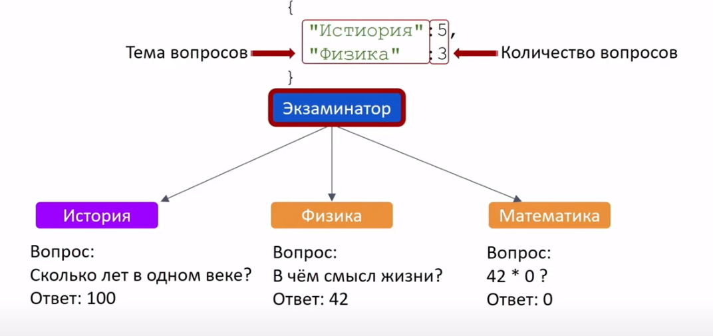

Задача:

Написать сервис Экзаминатор, который будет иметь единственный endpoint для людей, которые хотят получить какой-то экзамен.

На вход будет приходить map, в которой будут приходить название темы и сколько вопросов нужно.

В будущем будут приходить разные темы.

Каждый микросервис отвечает за конкретную тему.

Например:

- мс "История" - будет ходить в свою бд и доставать оттуда вопросы.

- мс "Математика" - не будет иметь никакой базы, но будет иметь логику.

и т.д.

Нужно будет наладить общение экзаменатора с микросервисами.

Внешний клиент обращается в экзаменатор, сообщает как скомпоновать экзамен, каких вопросов сколько, экзаменатор обращается к каждому микросервису, получает нужную секцию, объединяет эти секции в экзамен, добавляет Title и какие-то вещи, скомпонованный экзамен в формате JSON уходит на клиента.

